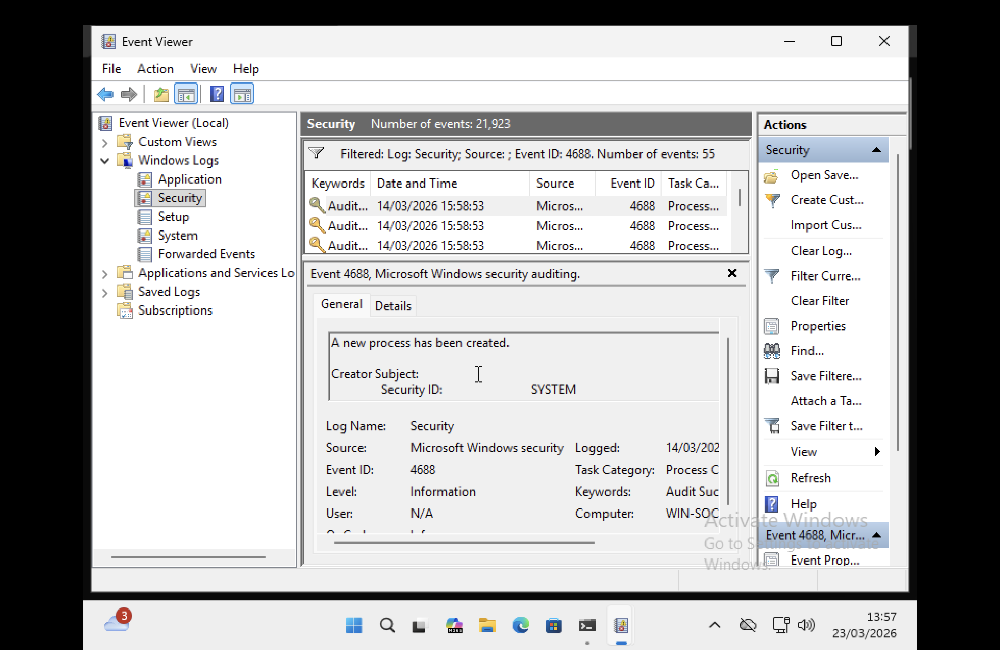

# windows-evtx-log-analysis
# Windows EVTX Log Analysis (SOC Lab)

## Overview
This project demonstrates how to analyze Windows Security Event Logs using Python in a Linux SOC lab environment.

The objective was to parse EVTX logs and identify process creation events (Event ID 4688), which are important for detecting potential malicious activity.

## Tools Used
- Ubuntu Linux
- Python
- python-evtx library
- Windows Event Viewer

## Lab Setup
- Windows machine used as log source
- Ubuntu VM used as SOC analysis environment
- EVTX logs transferred and analyzed using Python

## Detection Summary
The EVTX parser was used to analyze Windows Security logs.

Event ID 4688 (process creation) was successfully identified and parsed.

The analysis revealed multiple system-level processes such as:
- lsass.exe
- services.exe

These logs demonstrate how process activity is recorded and can be monitored for suspicious behavior.

## Screenshots

### EVTX Parsing Output

### Event Viewer Logs (Event ID 4688)

## Skills Demonstrated
- Windows log analysis
- Security event investigation
- Python scripting for log parsing
- Basic SOC workflow

## Author
SOC Lab Project
