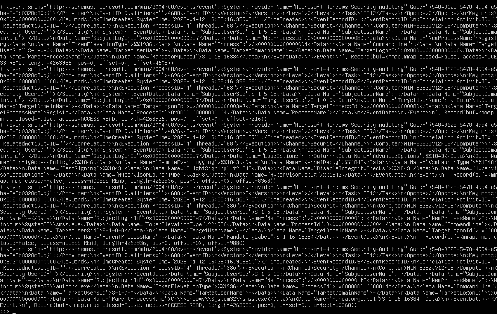
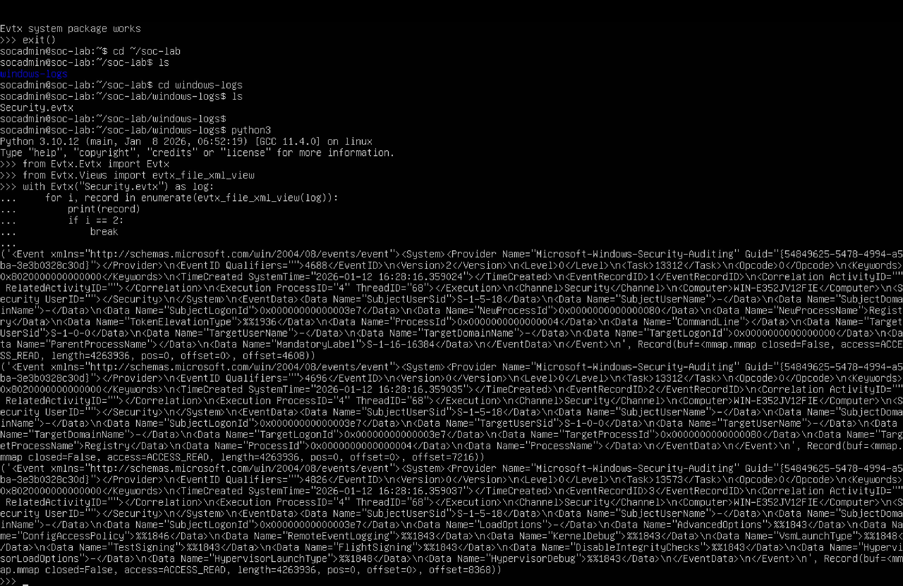
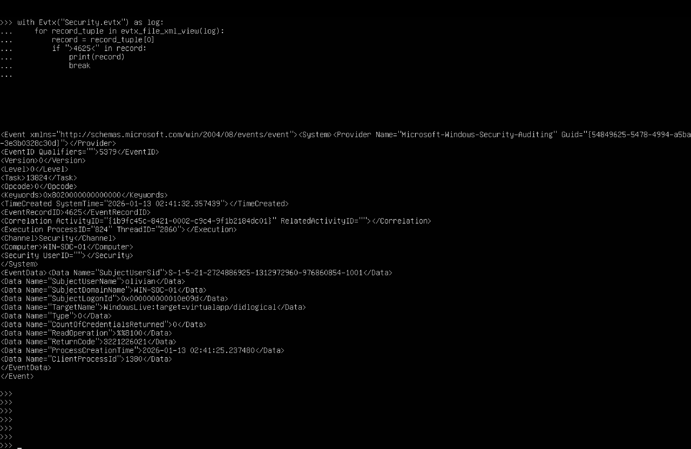
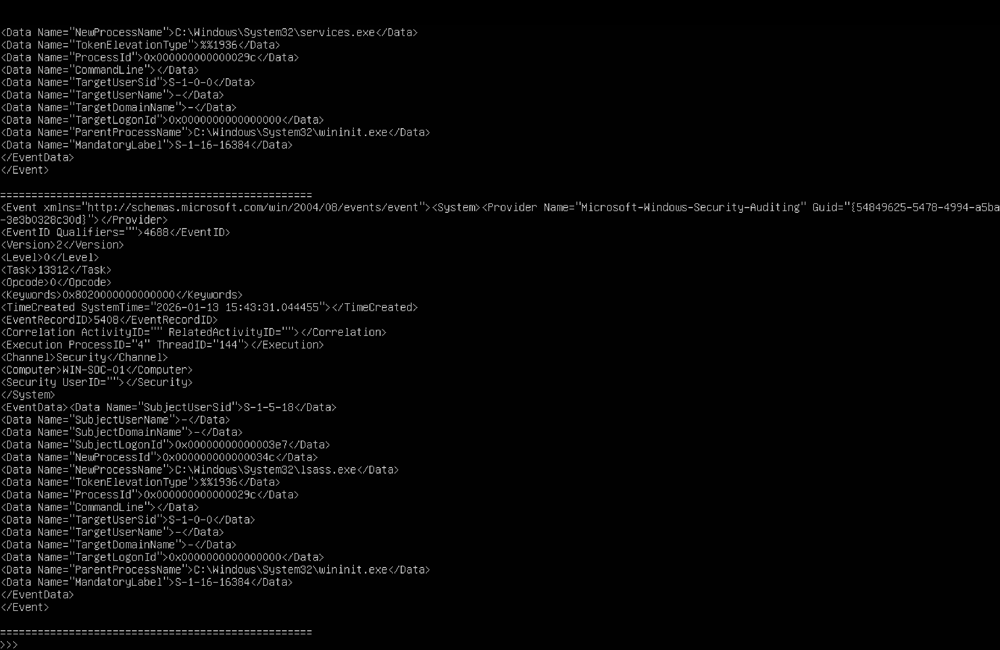

# Windows EVTX Log Analysis (Event ID 4688 Detection)

## 📌 Project Overview
This project demonstrates how to parse and analyze Windows Security Event Logs (EVTX) using Python.  
The focus is on identifying Event ID 4688 (Process Creation) to understand system activity and detect potential security-relevant behavior.

---

## 🎯 Objectives
- Parse EVTX log files using Python
- Extract and analyze security-relevant events
- Identify process creation activity (Event ID 4688)
- Observe system processes and execution flow

---

## 🛠️ Tools & Technologies
- Python
- python-evtx library
- Windows Security Logs (Security.evtx)

---

## 🔍 Key Findings
- Successfully parsed raw EVTX logs into readable XML format
- Identified multiple Event IDs including:
  - 4688 → Process Creation
  - 4689 → Process Termination
- Extracted important fields such as:
  - Process Name (e.g., smss.exe, autochk.exe)
  - Parent Process
  - User SID
  - Timestamp
- Observed system-level processes during system startup

---

## 📸 Screenshots

### Raw EVTX Log Output

### Multiple Events Displayed

### Event Filtering

### Process Analysis

---

## 🚀 How to Run

1. Install dependencies:
pip install python-evtx

2. Run the parser:
python evtx_parser.py

---

## 📚 What I Learned
- How Windows logs security events
- Importance of Event ID 4688 in threat detection
- Basics of log analysis for SOC environments
- Parsing and handling structured log data in Python

---

## 🔐 Relevance to Cybersecurity
Event ID 4688 is critical in detecting:
- Suspicious process execution
- Malware activity
- Unauthorized system changes

This project simulates how SOC analysts investigate endpoint activity using log data.
